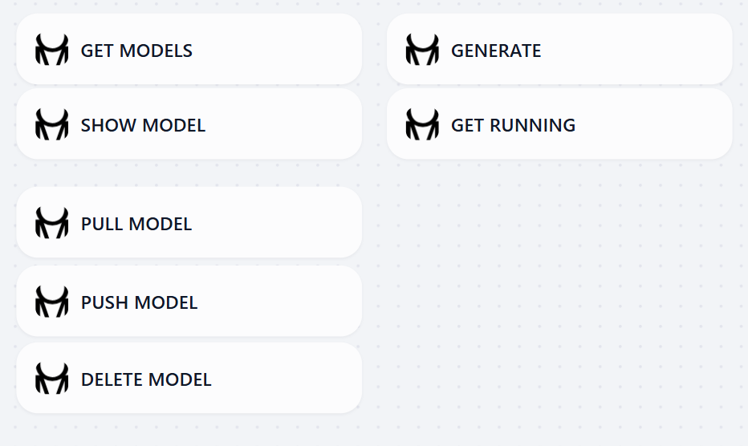

## dify-ollama-manage

**Author:** yt-koike
**Version:** 0.0.1
**Type:** tool

### Description

Ollama Manage is an unofficial Ollama plugin for Dify and is basically Ollama REST API turned into Dify nodes. This plugin offers you some features mainly to pull, delete models and other functions for managing Ollama models.

This plugin is named Ollama Manage to distinguish from [the Ollama plugin](https://marketplace.dify.ai/plugins/langgenius/ollama).

### Nodes

Ollama Manage has the following nodes.

- Get Models: Gets the list of available local models
- Show Model: Shows the details of the specified model
- Pull Model: Downloads the model
- Push Model: Uploads the model
- Delete Model: Deletes the specified model
- Generate: Completes the prompt
- Get Running: Gets the running processes

### Reference

- Repository: https://github.com/yt-koike/dify-ollama-manage
- About Ollama API: https://docs.ollama.com/api
- Logo: Made on https://text-to-svg.com/
